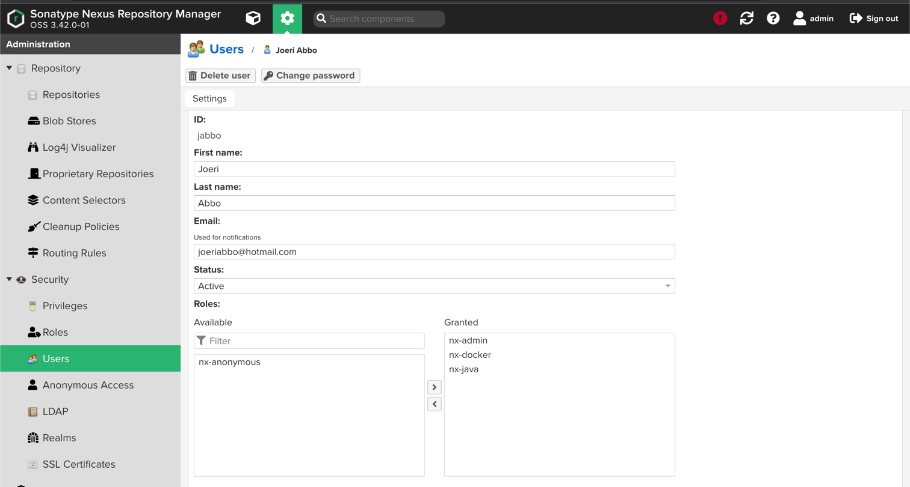

## Demo project for Module 6 - Artifact Repository Manager

In this demo I used the droplet from module 5 and installed nexus on it.
The minimum requirements for nexus are 4GB of ram and 2 cores. So I used a droplet with 4GB of ram and 2 cores.

### Install nexus

- Install Java(Already did this in module 5)
- I then added a new user to run nexus
    - ```adduser nexus```
    - ```usermod -aG sudo nexus```
- After installing the nexus files I changed the owner of the nexus files to the nexus user
    - ```chown -R nexus:nexus /opt/nexus```
- The I started the nexus service
    - ```/opt/nexus-3.42.0-01/bin/nexus start```
- To validate the nexus service is running I used the following command
    - ```netstat -lpnt```
- I then went to digital ocean and added a new firewall rule to allow port 8081
- After that I went to the server ip with the 8081 port and saw the nexus running. With the text Welcome to Nexus
  Repository Manager 3.42.0-01
- I retrieved the default password for nexus
    - ```cat /opt/sonatype-work/nexus3/admin.password```
- I then logged into nexus with the default password and changed the password
- After that I created a new user and gave it the permissions to create repositories and upload artifacts
    - 
- I then created a new maven repository and added it to the maven settings.xml file. This fallbacks to the default maven
  settings.xml file. That is why there is no password or username in the settings.xml file. (.m2)
    - ```<server>
        <id>nexus</id>
        <username></username>
        <password></password>
  </server>```
- I then added a build.gradle file to the app
- After that I run the following command to build the app
    - ```./gradlew build```
- After that I run the following command to upload the app to nexus
    - ```./gradlew publish```
- Then I build a Jar file with the following command
    - ```mvn package```
- After that I run the following command to upload the app to nexus
    - ```mvn deploy```
- 
- I then created a new Blob store to attach to future repos
- I then created cleanup policy and attach to repo